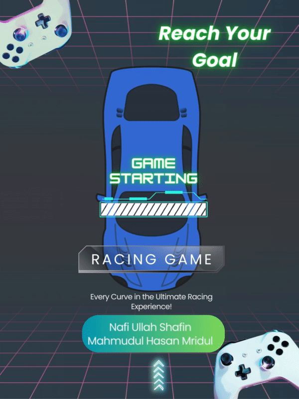
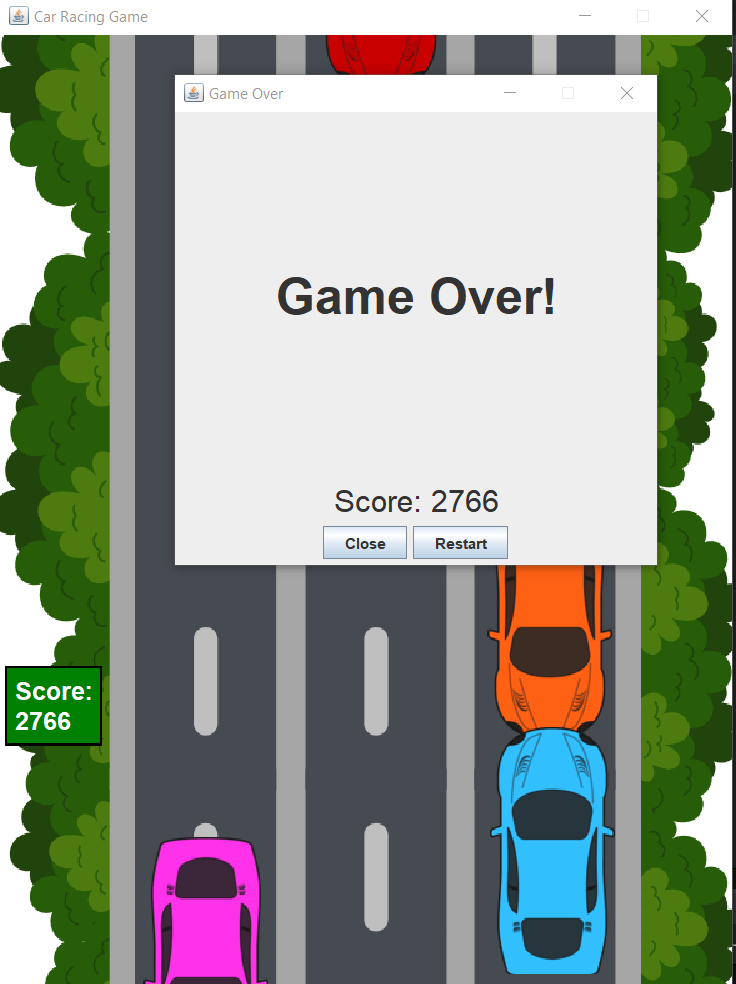

# Racing Game in Java Swing

Welcome to the Racing Game repository! This 2D racing game, built using Java Swing, brings the thrill of high-speed racing to your screen. 
Test your reflexes as you maneuver your car through challenging tracks with just the left and right arrow keys. 
With its simple yet addictive gameplay, this game is perfect for anyone looking for a quick racing fix.

## Game Details

- **Gameplay:** The player controls a car using the left and right arrow keys to avoid other cars.
- **Controls:** Use the **left arrow key** to move the car left and the **right arrow key** to move it right.
- **Objective:** Navigate through the track, avoiding obstacles like other cars, and cross the vehicles as much as possible.
- **Graphics:** The game features vibrant 2D graphics and a dynamic user interface, providing an immersive racing experience.

## How It's Made

This game is developed using Java Swing, a powerful GUI toolkit for Java. 
Eclipse IDE was used for the development process, offering a seamless environment for coding, debugging, and testing. 
The game utilizes event listeners to capture user input and update the car's position accordingly. 
The collision detection system ensures that the car interacts correctly with obstacles.

## Installation

Follow these steps to install and play the Racing Game:

1. **Clone the Repository:** Clone this repository to your local machine using the following command: <be>
<code> git clone https://github.com/nafi-ullah/Racing-Game.git </code>

2. **Open in Eclipse:** Launch Eclipse IDE and import the project by selecting **File** > **Import** > **General** > **Existing Projects into Workspace**. Browse to the cloned repository directory and select it.

3. **Compile and Run:** Build and run the game by selecting the **Driver** class and clicking the "Run" button in Eclipse.

4. **Play the Game:** Use the left and right arrow keys to control the car and navigate through the track. Aim for the finish line while avoiding obstacles.

## Creators

This Racing Game was created by 
1. Nafi Ullah Shafin
   Reg: 2020 831 004
   Software Engineering Department, SUST
3. Mahmudul Hasan Mridul
   Reg: 2020 831 005
   Software Engineering Department, SUST
   
We are passionate about game development and wanted to share our excitement with fellow gaming enthusiasts. 
Feel free to reach out to us with any feedback, suggestions, or questions!

## Game Play Video Recorded Link:  
https://drive.google.com/drive/folders/1Mc83gxeSZQdrW25QQqzRg0iO3Xm3URQB?usp=sharing

## Game Scenery

**Game Play...**

**Game Over...**

Enjoy the thrill of racing in this Java Swing masterpiece! Thank you for playing!
